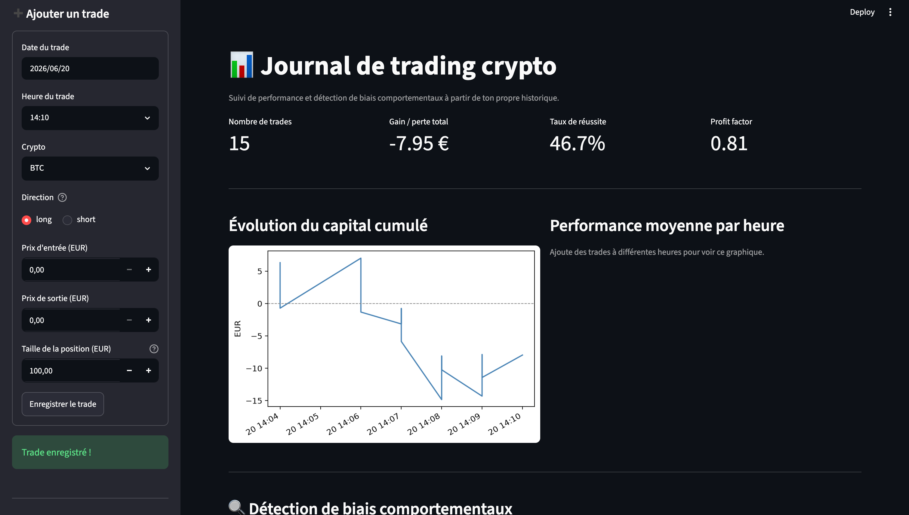
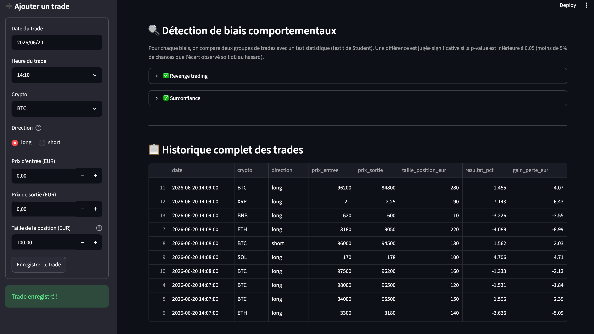
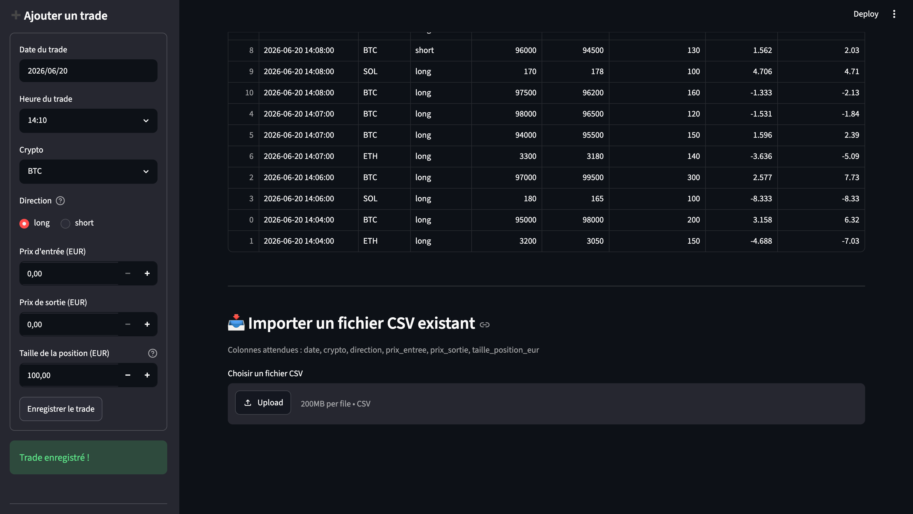

# 📊 Journal de trading crypto — Analyse comportementale

Application web (Streamlit) permettant d'enregistrer son propre historique de trading crypto et de détecter automatiquement des **biais comportementaux** connus en finance comportementale (revenge trading, surconfiance, trading nocturne, tilt), à partir de tests statistiques simples.

## Pourquoi ce projet ?

Les plateformes d'échange comme Binance fournissent des statistiques de performance (gains, pertes, historique), mais aucune ne propose d'analyse de **comportement** : à quel moment tradez-vous le moins bien, et pourquoi ? Ce projet comble ce manque avec une approche simple et transparente, basée sur des tests statistiques plutôt que sur une boîte noire.

Né de ma propre expérience de trading indépendant sur les cryptomonnaies (2018–2025), ce projet applique une démarche de data science à un sujet que je connais de l'intérieur.

## Fonctionnalités

- **Saisie manuelle** des trades via un formulaire (date, crypto, direction, prix d'entrée/sortie, taille de position)
- **Calcul automatique** du résultat (%) et du gain/perte en euros
- **Tableau de bord de performance** : gain total, taux de réussite, profit factor, évolution du capital cumulé
- **Détection de 4 biais comportementaux**, chacun testé statistiquement (test t de Student, seuil de significativité à 5%) :
  - *Revenge trading* — tendance à augmenter la taille des positions après une perte
  - *Surconfiance* — tendance à augmenter la taille des positions après un gros gain
  - *Trading nocturne* — performance dégradée la nuit (22h–3h)
  - *Tilt* — dégradation des résultats après plusieurs pertes consécutives
- **Import CSV** pour ajouter un historique existant en une fois
- Toutes les données restent **locales** (fichier CSV sur ta machine, rien n'est envoyé en ligne)

## Aperçu

**Tableau de bord** — métriques de performance et évolution du capital cumulé



**Détection de biais comportementaux** — alertes basées sur des tests statistiques



**Historique complet des trades**



## Installation

```bash
git clone https://github.com/OphisLuka/journal-trading.git
cd journal-trading
pip install -r requirements.txt
```

## Utilisation

```bash
streamlit run app.py
```

L'application s'ouvre automatiquement dans le navigateur à l'adresse `http://localhost:8501`.

- Ajoute tes trades un par un via le formulaire dans la barre latérale, **ou**
- Importe un fichier CSV existant (colonnes attendues : `date, crypto, direction, prix_entree, prix_sortie, taille_position_eur`)

## Méthode statistique

Pour chaque biais, l'outil compare la moyenne d'une variable (taille de position ou résultat) entre deux groupes de trades (par exemple "après une perte" vs "après un gain"), à l'aide d'un test t de Student. Une différence est considérée comme significative si la p-value est inférieure à 0.05 — c'est-à-dire moins de 5% de chances que l'écart observé soit dû au hasard plutôt qu'à un vrai effet.

Avec moins de 15 trades enregistrés, les résultats restent peu fiables statistiquement : l'application en avertit l'utilisateur.

## Stack technique

- Python
- [Streamlit](https://streamlit.io/) — interface web interactive
- [pandas](https://pandas.pydata.org/) — manipulation des données
- [SciPy](https://scipy.org/) — tests statistiques
- [Matplotlib](https://matplotlib.org/) — visualisations

## Limites et pistes d'amélioration

- L'échantillon de trades doit être suffisant (15+) pour que les tests statistiques aient du sens
- Les biais détectés sont corrélationnels, pas causaux : ils signalent un pattern, pas une explication garantie
- Pistes futures : ajouter un export PDF du rapport, comparer les performances par crypto, déploiement en ligne (Streamlit Community Cloud) pour un accès multi-appareils

## Auteur

[OphisLuka](https://github.com/OphisLuka) — en formation Ingénieur IA (OpenClassrooms), précédemment trader indépendant sur les marchés cryptomonnaies.
